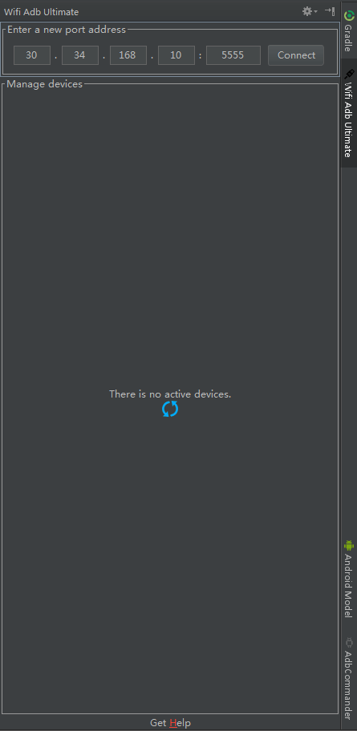
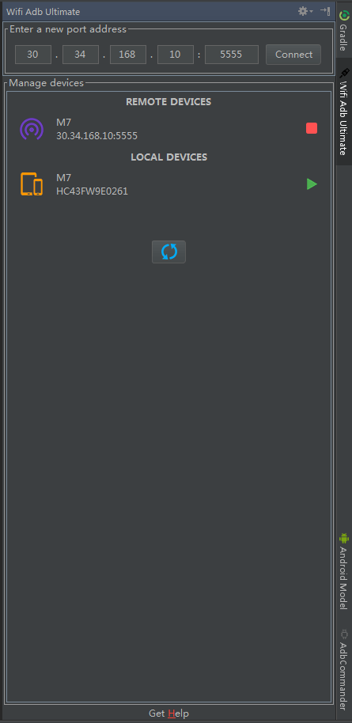

# WIFI ADB ULTIMATE

## Screenshot

## Installation
1. You can visit [here](https://github.com/Sausure/WIFIADB/tree/master/WIFIADBIntelliJPlugin/out) to get the latest version

## Features
1. If you has already installed [this application](https://github.com/Sausure/WIFIADB/tree/master/WIFIADBAndroid) I provided,you would no longer need an USB cable.
You can quickly gain a row of adb tcp numbers and parse it to this plugin,then press `Connect` button,and now you can run or debug your application over wifi.
`I recommend you to install this application then tell me your suggestions,thanks!`
2. Or If you don't want to install the application above,your should connect devices to PC over USB cable and press `Refresh` image button,
then press `Connect` image button which right of the target device,after that you can unplug the USB cable

## Thanks
[AndroidWiFiADB](https://github.com/pedrovgs/AndroidWiFiADB)

## To Do
I will add more features and I need your suggestions,thanks!

## License

    Copyright 2016 Sausure.

    Licensed under the Apache License, Version 2.0 (the "License");
    you may not use this file except in compliance with the License.
    You may obtain a copy of the License at

       http://www.apache.org/licenses/LICENSE-2.0

    Unless required by applicable law or agreed to in writing, software
    distributed under the License is distributed on an "AS IS" BASIS,
    WITHOUT WARRANTIES OR CONDITIONS OF ANY KIND, either express or implied.
    See the License for the specific language governing permissions and
    limitations under the License.

